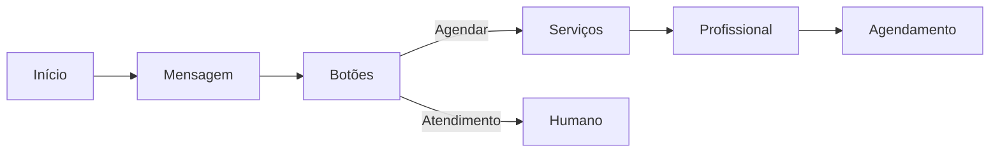
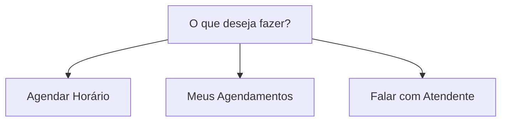
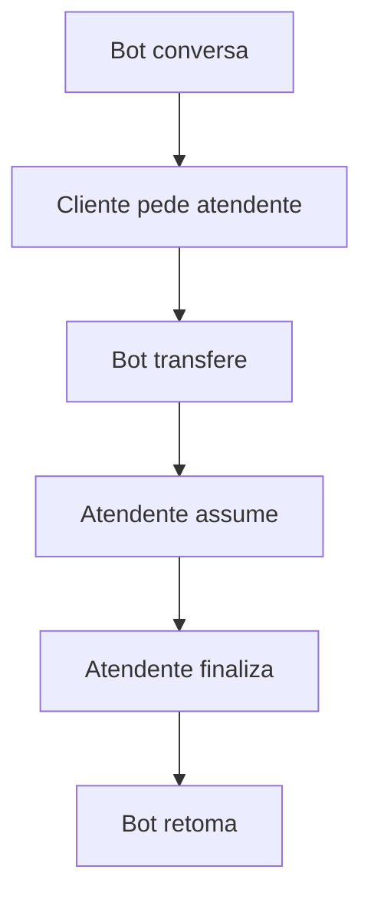

# Guia de Bots

Bots são assistentes virtuais que conversam com seus clientes no WhatsApp. Eles podem agendar serviços, responder dúvidas e transferir para atendimento humano.

## O que é um bot?

Um bot é um fluxo de conversa automatizado:

```
Cliente: Olá!
   ↓
Bot: Olá! Bem-vindo à Barbearia do João!
     O que você gostaria de fazer?
     1. Agendar horário
     2. Ver meus agendamentos
     3. Falar com atendente
   ↓
Cliente: 1
   ↓
Bot: Qual serviço você deseja?
     [Lista de Serviços]
```

## Acessando bots

1. Clique em **Configurações** no menu lateral
2. Selecione **Bots**

## Criando um bot

### Opção 1: Usar template (recomendado)

Templates são bots prontos que podem ser personalizados:

1. Clique em **Novo Bot**
2. Escolha **Usar Template**
3. Selecione o template desejado:
   - **Agendamento Simples** — Fluxo básico
   - **Agendamento Completo** — Com seleção de profissional
   - **Atendimento Híbrido** — Bot + atendimento humano
4. Clique em **Criar**

> [!TIP]
> Templates já vêm configurados. Personalize mensagens e adicione recursos depois.

### Opção 2: Criar do zero

Para usuários avançados:

1. Clique em **Novo Bot**
2. Escolha **Bot em Branco**
3. Defina um nome
4. Clique em **Criar**

## Estrutura de um bot

Um bot é composto por **nós** (componentes) e **conexões** (arestas):



### Componentes principais

| Componente | Função |
|------------|--------|
| **Mensagem** | Envia texto ao cliente |
| **Botões** | Menu de opções clicáveis |
| **Lista** | Lista scrollável de opções |
| **Serviços** | Seleção de serviços |
| **Profissional** | Seleção de profissional |
| **Agendamento** | Escolha de data/hora |
| **Termos** | Aceite de termos |
| **Atendimento** | Transferência para humano |

## Editor de bot

### Área de trabalho

- **Arrastar** — Mova componentes
- **Conectar** — Ligue saídas às entradas
- **Zoom** — Use scroll ou botões
- **Centralizar** — Botão de ajuste

### Barra lateral

- **Componentes** — Arraste para adicionar
- **Configurações** — Ajustes do bot
- **Variáveis** — Dados dinâmicos

### Barra de ferramentas

- **Salvar** — Salva alterações
- **Desfazer/Refazer** — Ctrl+Z / Ctrl+Y
- **Visualizar** — Testa o fluxo
- **Publicar** — Coloca em produção

## Componentes essenciais

### Mensagem

Envia uma mensagem de texto:

```
Olá {{cliente.nome}}!

Seja bem-vindo à Barbearia do João!
Como posso ajudar você hoje?
```

> [!TIP]
> Use `{{variavel}}` para personalizar mensagens.

### Botões

Cria menu com opções clicáveis:



### Seleção de serviço

- Mostra serviços ativos
- Exibe preço e duração
- Cliente seleciona um

### Seleção de profissional

- Filtra por serviço selecionado
- Mostra foto e nome
- Opção "qualquer profissional"

### Agendamento

- Mostra dias disponíveis
- Horários livres do profissional
- Confirmação do agendamento

## Variáveis

Variáveis armazenam informações durante a conversa:

### Variáveis do Sistema

| Variável | Conteúdo |
|----------|----------|
| `{{cliente.nome}}` | Nome do cliente |
| `{{cliente.telefone}}` | Telefone |
| `{{servico.nome}}` | Serviço escolhido |
| `{{profissional.nome}}` | Profissional |
| `{{agendamento.data}}` | Data marcada |
| `{{agendamento.hora}}` | Horário |

### Usando Variáveis

```
Perfeito, {{cliente.nome}}! 🎉

Seu agendamento está confirmado:
📅 {{agendamento.data}}
⏰ {{agendamento.hora}}
💇 {{servico.nome}}
👤 {{profissional.nome}}

Te esperamos!
```

## Publicando o bot

Após criar ou editar o bot:

1. Clique em **Salvar**
2. Clique em **Publicar**
3. Confirme a publicação

> [!WARNING]
> A publicação substitui a versão em produção. Sempre teste antes.

### Versões

- **Rascunho** — Versão em edição
- **Produção** — Versão ativa
- **Histórico** — Versões anteriores

## Testando o bot

### No editor

1. Clique em **Visualizar** ou **Testar**
2. Uma simulação abrirá
3. Interaja como se fosse um cliente

### No WhatsApp

1. Configure o [Canal de Teste](/app/tutorials?doc=guides/canais)
2. Vincule o bot ao canal
3. Envie mensagem para o número de teste

## Atendimento híbrido

Combine bot com atendimento humano:



### Componente de atendimento

- Verifica horário comercial
- Checa disponibilidade de atendentes
- Transfere a conversa
- Notifica sobre fila

## Boas práticas

### Recomendado

- Comece com templates
- Use mensagens curtas e claras
- Teste antes de publicar
- Ofereça opção de atendente

### Evite

- Mensagens muito longas
- Muitas opções de uma vez
- Fluxos muito complexos
- Publicar sem testar
- Ignorar fallbacks (tratamento de erro)

## Configurações avançadas

### Fallback

Configure o que acontece quando o cliente envia algo inesperado:

```
Bot: Escolha uma opção:
     1. Agendar
     2. Cancelar

Cliente: "Quero saber o preço"

Bot: Desculpe, não entendi. 
     Por favor, escolha uma das opções:
     1. Agendar
     2. Cancelar
```

### Horário comercial

Configure o bot para horários específicos:

- **Dentro do horário** → Fluxo normal
- **Fora do horário** → Mensagem especial

### Múltiplos estabelecimentos

Se você tem várias unidades:

1. Adicione componente de **Seleção de Estabelecimento**
2. Posicione antes de serviços/profissionais
3. O fluxo continuará para a unidade escolhida

---

## Próximos passos

- [Guia de Canais](/app/tutorials?doc=guides/canais) — Conecte seu bot ao WhatsApp
- [Guia de Serviços](/app/tutorials?doc=guides/servicos) — Configure serviços
- [Guia de Profissionais](/app/tutorials?doc=guides/profissionais) — Configure equipe
