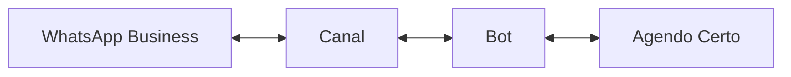
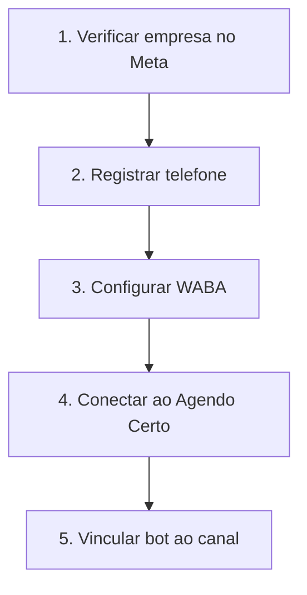
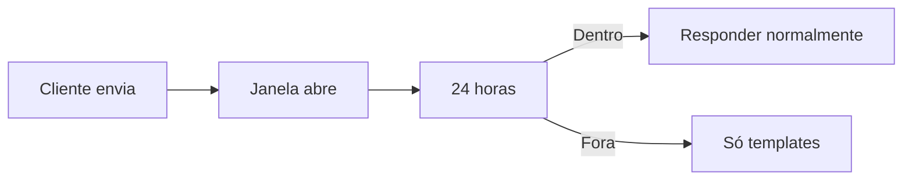
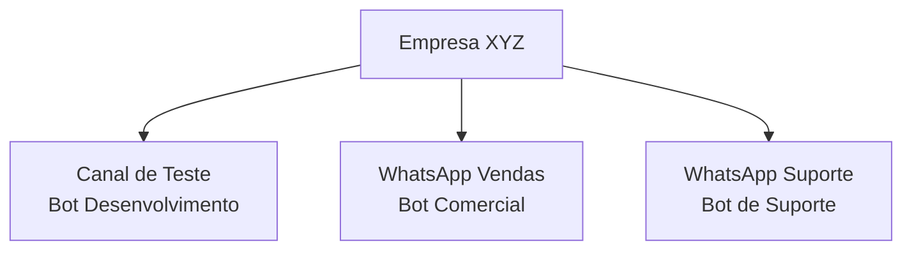

# Guia de Canais

Canais conectam seus bots às plataformas de mensagens. É através deles que seus clientes conversam com os bots.

## O que são canais?

Um canal conecta seu bot a uma plataforma:



### Tipos de canal

| Canal | Descrição | Status |
|-------|-----------|--------|
| **WhatsApp Business** | Canal oficial | Disponível |
| **Canal de Teste** | Para desenvolvimento | Disponível |
| Instagram | Mensagens do Instagram | Em breve |
| Telegram | Bot do Telegram | Em breve |

## Acessando canais

1. Clique em **Configurações** no menu lateral
2. Selecione **Canais**

## Canal de teste

Ambiente seguro para testar seus bots.

### Características

- Não afeta clientes reais
- Funcionalidades completas
- Mensagens gratuitas
- Ideal para desenvolvimento

### Configuração

1. Clique no **Canal de Teste**
2. Veja o número do canal
3. Adicione números autorizados
4. Vincule um bot

### Números autorizados

Apenas números autorizados podem testar:

1. Na seção **Números Autorizados**
2. Clique em **Adicionar Número**
3. Digite o número com DDD: `5511999999999`
4. Clique em **Salvar**

> [!WARNING]
> Este passo é **obrigatório**. Sem número autorizado, não é possível testar.

### Vinculando um bot

1. Clique em **Editar Canal**
2. No campo **Bot**, selecione seu bot
3. Clique em **Salvar**

## WhatsApp Business

Canal para uso em produção com clientes reais.

### Requisitos

Para usar o WhatsApp Business API:

- Conta Meta Business verificada
- Número de telefone dedicado
- Política de uso do WhatsApp aceita
- Plano Agendo Certo compatível

### Processo de configuração



> [!NOTE]
> A configuração do WhatsApp Business requer verificação da Meta, que pode levar alguns dias.

## Configurações do canal

### Informações básicas

| Campo | Descrição |
|-------|-----------|
| Nome | Nome identificador do canal |
| Descrição | Detalhes sobre o uso |
| Status | Ativo ou Inativo |
| Bot | Bot vinculado |

### Configurações avançadas

| Configuração | Descrição |
|--------------|-----------|
| **Horário** | Quando o bot responde |
| **Mensagem de ausência** | Fora do horário |
| **Timeout** | Tempo máximo de conversa |
| **Retorno** | Mensagem após inatividade |

## Mensagens do WhatsApp

### Tipos de mensagem

| Tipo | Iniciado por | Custo |
|------|--------------|-------|
| **Conversa de Usuário** | Cliente | Incluído |
| **Conversa de Marketing** | Empresa | Cobrado |
| **Conversa de Utilidade** | Empresa | Cobrado |
| **Conversa de Autenticação** | Empresa | Cobrado |

### Janela de 24 horas

O WhatsApp tem uma regra importante:



> [!TIP]
> Respostas automáticas do bot mantêm a conversa ativa dentro da janela.

### Templates de mensagem

Para iniciar conversas ou responder após 24h:

1. Crie um template no Meta Business
2. Aguarde aprovação (24-48h)
3. Use no Agendo Certo

```
Olá {{1}}!

Seu agendamento está confirmado:
{{2}} às {{3}}
{{4}}

Te esperamos!
```

## Métricas e relatórios

Acompanhe o desempenho do canal:

| Métrica | Descrição |
|---------|-----------|
| **Mensagens Recebidas** | Total de mensagens de clientes |
| **Mensagens Enviadas** | Total de respostas do bot |
| **Conversas** | Número de conversas únicas |
| **Taxa de Resolução** | % resolvido pelo bot |
| **Tempo Médio** | Duração das conversas |

## Múltiplos canais

Você pode ter vários canais ativos:



### Casos de uso

- **Por departamento** — Vendas, suporte, RH
- **Por unidade** — Filial A, Filial B
- **Por propósito** — Agendamento, informações

## Boas práticas

### Recomendado

- Sempre teste antes de ir para produção
- Mantenha números autorizados atualizados
- Configure mensagens de ausência
- Monitore métricas regularmente
- Responda dentro de 24 horas

### Evite

- Publicar bot sem testar
- Ignorar políticas do WhatsApp
- Enviar spam ou mensagens em massa
- Deixar clientes sem resposta
- Usar números pessoais

## Solução de problemas

### Canal não recebe mensagens

1. Verifique se o canal está **Ativo**
2. Confirme se há um **Bot vinculado**
3. Cheque se o número está **Autorizado** (teste)
4. Verifique a conexão com a Meta (produção)

### Bot não responde

1. Verifique se o bot está **Publicado**
2. Confira se o bot está **Vinculado ao canal**
3. Teste o bot no **Visualizador**
4. Verifique logs de erro

### Mensagens atrasadas

1. Verifique sua conexão de internet
2. Cheque status dos servidores
3. Contate o suporte se persistir

> [!TIP]
> A maioria dos problemas se resolve verificando: Bot publicado? Canal ativo? Número autorizado?

---

## Próximos passos

- [Guia de Bots](/app/tutorials?doc=guides/bots) — Crie e personalize bots
- [Tutorial de Configuração](/app/tutorials?doc=getting-started/02-configuracao-inicial) — Passo a passo completo
- [Bem-vindo](/app/tutorials?doc=getting-started/01-bem-vindo) — Visão geral da plataforma
