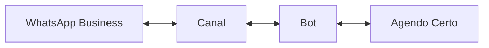
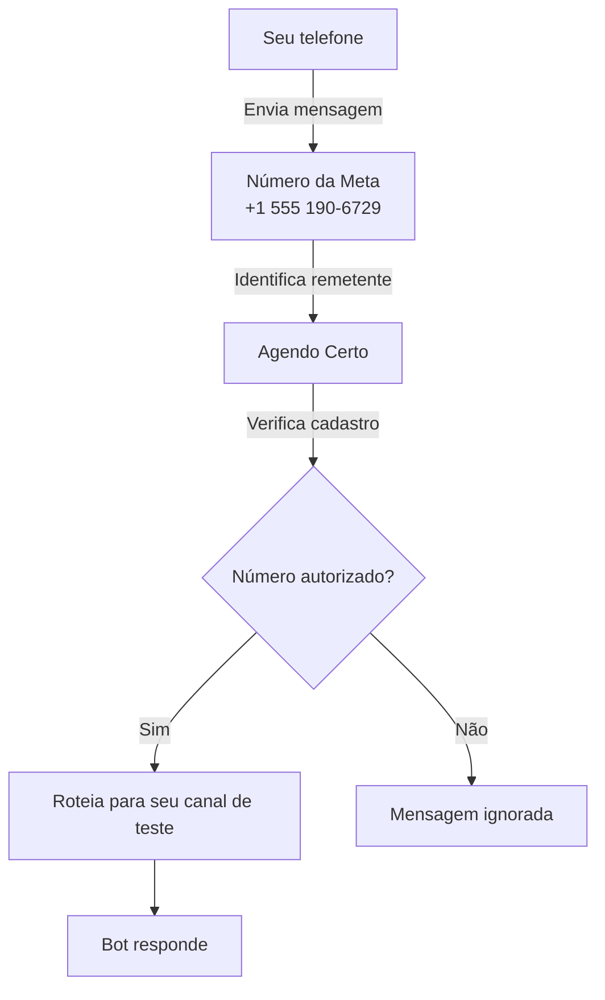
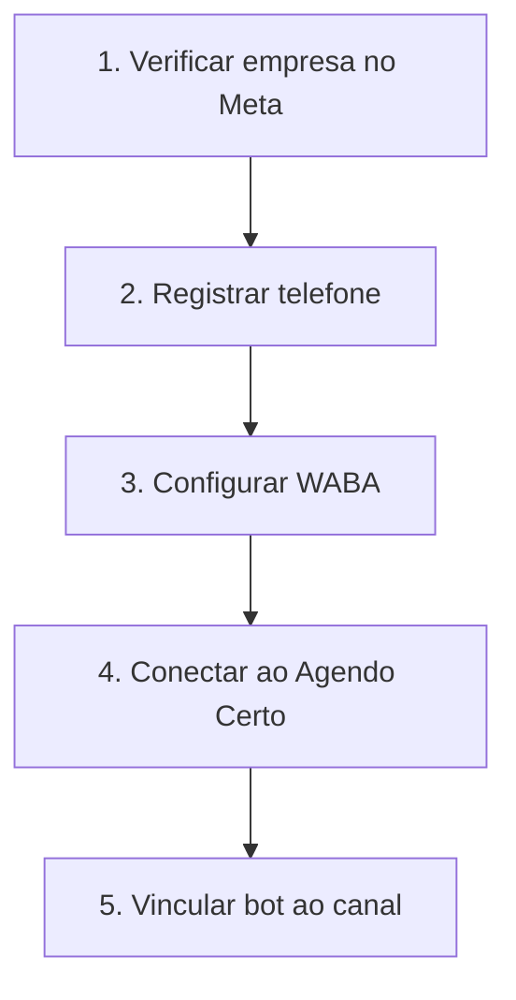
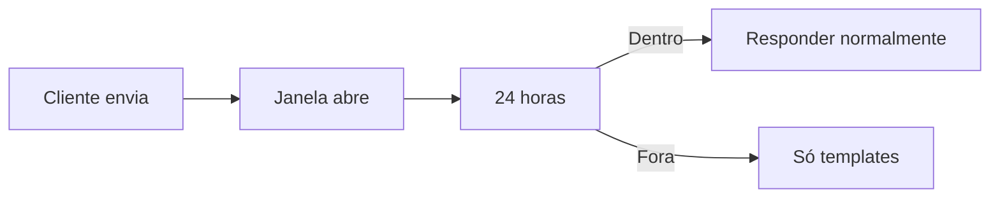
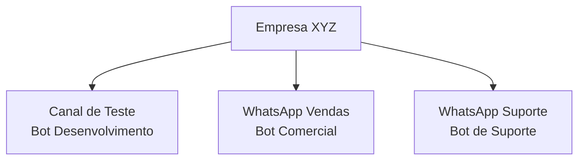

# Guia de Canais

Canais conectam seus bots às plataformas de mensagens. É através deles que seus clientes conversam com os bots.

## O que são canais?

Um canal conecta seu bot a uma plataforma:



### Tipos de canal

| Canal | Descrição | Status |
|-------|-----------|--------|
| **WhatsApp Business** | Canal oficial | Disponível |
| **Canal de Teste** | Para desenvolvimento | Disponível |
| Instagram | Mensagens do Instagram | Em breve |
| Telegram | Bot do Telegram | Em breve |

## Acessando canais

1. Clique em **Configurações** no menu lateral
2. Selecione **Canais**

## Canal de teste (Sandbox)

O canal de teste é um ambiente sandbox que utiliza a infraestrutura oficial da Meta para WhatsApp Business API. Ele permite testar seus bots antes de colocá-los em produção, sem afetar clientes reais e sem custos de mensagens.

### Como funciona

O canal de teste utiliza um número compartilhado da Meta (`+1 555 190-6729`) como ponto de entrada. Para diferenciar cada usuário, o sistema identifica as mensagens pelo número do **remetente** (seu telefone cadastrado).



### Passo a passo para testar

1. **Vincule um bot ao canal de teste**
   - Acesse o canal de teste
   - Clique em **Editar Canal**
   - Selecione o bot que deseja testar
   - Salve as alterações

2. **Cadastre seu número de telefone**
   - Na seção **Números Autorizados**, clique em **Adicionar Número**
   - Digite seu número no formato internacional: `+5511999999999`
   - Clique em **Salvar**

3. **Envie uma mensagem de teste**
   - No WhatsApp, adicione o número `+1 555 190-6729` aos seus contatos
   - Envie qualquer mensagem para esse número
   - O bot vinculado ao seu canal responderá automaticamente

### Números autorizados

Cada canal de teste pode ter até **30 números autorizados**. Apenas telefones cadastrados conseguem interagir com o bot no ambiente sandbox.

| Campo | Formato | Exemplo |
|-------|---------|---------|
| Número | Código do país + DDD + número | +5511999999999 |

> [!TIP]
> Você pode cadastrar números de toda a sua equipe para que todos testem o bot durante o desenvolvimento.

### Testando diferentes bots

O canal de teste permite trocar o bot vinculado a qualquer momento:

1. Acesse o canal de teste
2. Clique em **Editar Canal**
3. Selecione outro bot
4. Salve e envie uma nova mensagem

A próxima mensagem enviada ao número de teste será processada pelo novo bot.

### Limitações do ambiente de teste

| Aspecto | Comportamento |
|---------|---------------|
| Número de envio | Compartilhado entre todos os usuários Meta |
| Números autorizados | Máximo de 30 por canal |
| Funcionalidades | Todas disponíveis (agendamento, atendimento humano, etc.) |
| Custo | Gratuito |
| Mensagens ativas | Não é possível enviar mensagens proativas |

> [!NOTE]
> No ambiente de teste, você só pode responder a mensagens iniciadas por você. Mensagens proativas (templates) só funcionam em canais de produção.

## WhatsApp Business

Canal para uso em produção com clientes reais.

### Requisitos

Para usar o WhatsApp Business API:

- Conta Meta Business verificada
- Número de telefone dedicado
- Política de uso do WhatsApp aceita
- Plano Agendo Certo compatível

### Processo de configuração



> [!NOTE]
> A configuração do WhatsApp Business requer verificação da Meta, que pode levar alguns dias.

## Configurações do canal

### Informações básicas

| Campo | Descrição |
|-------|-----------|
| Nome | Nome identificador do canal |
| Descrição | Detalhes sobre o uso |
| Status | Ativo ou Inativo |
| Bot | Bot vinculado |

### Configurações avançadas

| Configuração | Descrição |
|--------------|-----------|
| **Horário** | Quando o bot responde |
| **Mensagem de ausência** | Fora do horário |
| **Timeout** | Tempo máximo de conversa |
| **Retorno** | Mensagem após inatividade |

## Mensagens do WhatsApp

### Tipos de mensagem

| Tipo | Iniciado por | Custo |
|------|--------------|-------|
| **Conversa de Usuário** | Cliente | Incluído |
| **Conversa de Marketing** | Empresa | Cobrado |
| **Conversa de Utilidade** | Empresa | Cobrado |
| **Conversa de Autenticação** | Empresa | Cobrado |

### Janela de 24 horas

O WhatsApp tem uma regra importante:



> [!TIP]
> Respostas automáticas do bot mantêm a conversa ativa dentro da janela.

### Templates de mensagem

Para iniciar conversas ou responder após 24h:

1. Crie um template no Meta Business
2. Aguarde aprovação (24-48h)
3. Use no Agendo Certo

```
Olá {{1}}!

Seu agendamento está confirmado:
{{2}} às {{3}}
{{4}}

Te esperamos!
```

## Métricas e relatórios

Acompanhe o desempenho do canal:

| Métrica | Descrição |
|---------|-----------|
| **Mensagens Recebidas** | Total de mensagens de clientes |
| **Mensagens Enviadas** | Total de respostas do bot |
| **Conversas** | Número de conversas únicas |
| **Taxa de Resolução** | % resolvido pelo bot |
| **Tempo Médio** | Duração das conversas |

## Múltiplos canais

Você pode ter vários canais ativos:



### Casos de uso

- **Por departamento** — Vendas, suporte, RH
- **Por unidade** — Filial A, Filial B
- **Por propósito** — Agendamento, informações

## Boas práticas

### Recomendado

- Sempre teste antes de ir para produção
- Mantenha números autorizados atualizados
- Configure mensagens de ausência
- Monitore métricas regularmente
- Responda dentro de 24 horas

### Evite

- Publicar bot sem testar
- Ignorar políticas do WhatsApp
- Enviar spam ou mensagens em massa
- Deixar clientes sem resposta
- Usar números pessoais

## Solução de problemas

### Canal de teste não responde

1. **Verifique se seu número está autorizado**
   - Acesse o canal de teste
   - Confira se seu número aparece na lista de números autorizados
   - O formato deve ser internacional: `+5511999999999`

2. **Verifique se há um bot vinculado**
   - O canal precisa ter um bot selecionado
   - O bot deve estar **publicado** (não apenas salvo)

3. **Confirme o número de destino**
   - Envie mensagens para `+1 555 190-6729`
   - Não use outro número

4. **Aguarde alguns segundos**
   - A primeira mensagem pode levar até 10 segundos para processar

### Canal de produção não recebe mensagens

1. Verifique se o canal está **Ativo**
2. Confirme se há um **Bot vinculado** e **publicado**
3. Verifique a conexão com a Meta no painel do canal
4. Cheque se o número do WhatsApp Business está operacional

### Bot não responde

1. Verifique se o bot está **Publicado**
2. Confira se o bot está **Vinculado ao canal**
3. Teste o bot no **Visualizador** do editor
4. Verifique se não há erros no fluxo

### Mensagens atrasadas

1. Verifique sua conexão de internet
2. Cheque status dos servidores
3. Contate o suporte se persistir

> [!TIP]
> A maioria dos problemas se resolve verificando: Bot publicado? Canal ativo? Número autorizado?

---

## Próximos passos

- [Guia de Bots](/app/tutorials?doc=guides/bots) — Crie e personalize bots
- [Tutorial de Configuração](/app/tutorials?doc=getting-started/02-configuracao-inicial) — Passo a passo completo
- [Bem-vindo](/app/tutorials?doc=getting-started/01-bem-vindo) — Visão geral da plataforma
