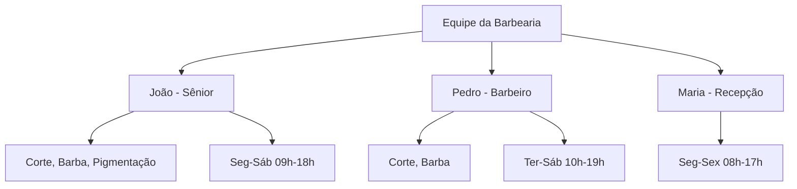
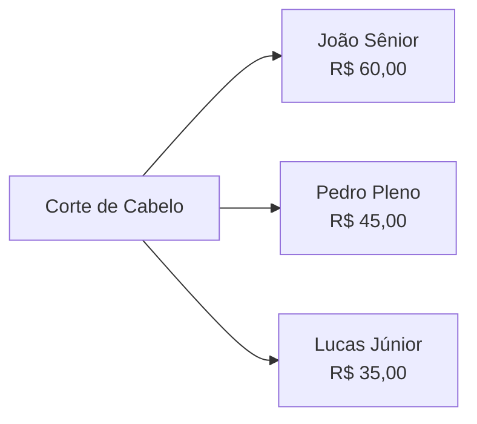
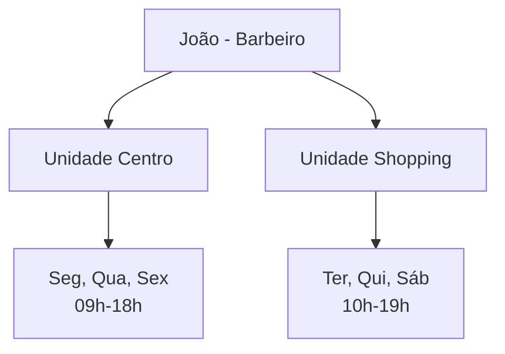
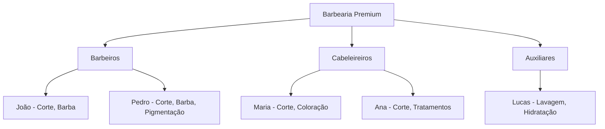
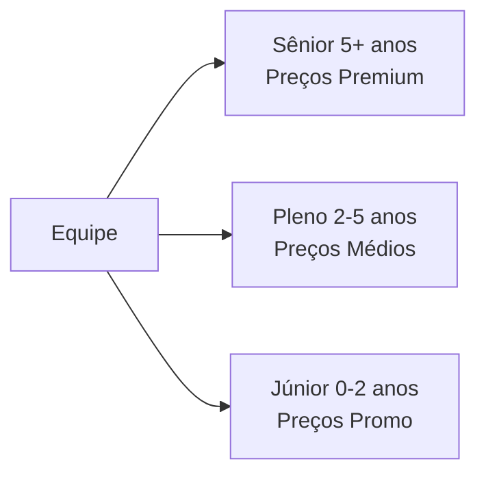

# Guia de Profissionais

Profissionais são as pessoas que realizam os serviços. Cada profissional tem sua própria agenda, serviços e configurações.

## O que são profissionais?

Representa um membro da sua equipe:

## Acessando profissionais

1. Clique em **Configurações** no menu lateral
2. Selecione **Profissionais**

## Criando um profissional

### Passo a passo

1. Clique em **Novo Profissional**
2. Preencha as informações básicas
3. Configure horários de trabalho
4. Vincule serviços
5. Clique em **Salvar**

### Campos do profissional

| Campo | Obrigatório | Descrição |
|-------|-------------|------------|
| Nome | Sim | Nome completo |
| E-mail | Sim | E-mail para notificações |
| Telefone | Não | Contato do profissional |
| Foto | Não | Imagem do profissional |
| Descrição | Não | Bio ou especialidades |
| Ativo | Sim | Se está disponível |

## Horários de Trabalho

Configure quando o profissional está disponível para atendimento.

### Configurando Horários

Para cada dia da semana:

| Dia | Trabalha | Início | Término |
|-----|----------|--------|---------|
| Segunda | ✅ | 09:00 | 18:00 |
| Terça | ✅ | 09:00 | 18:00 |
| Quarta | ❌ | - | - |
| Quinta | ✅ | 09:00 | 18:00 |
| Sexta | ✅ | 09:00 | 18:00 |
| Sábado | ✅ | 09:00 | 13:00 |
| Domingo | ❌ | - | - |

### Intervalo (Almoço)

Se o profissional faz intervalo:

1. Configure múltiplos períodos
2. Exemplo:
   - Período 1: 09:00 - 12:00
   - Período 2: 14:00 - 18:00

> [!NOTE]
> Os horários do profissional devem estar dentro do horário do estabelecimento!

## Vinculando serviços

Um profissional precisa ter serviços vinculados para aparecer nos agendamentos.

### Como vincular

1. Edite o profissional
2. Acesse a aba **Serviços**
3. Clique em **Adicionar Serviço**
4. Selecione os serviços
5. (Opcional) Defina preços personalizados

### Preço por profissional

Cada profissional pode ter preços diferentes:

> [!TIP]
> Deixe o preço em branco para usar o preço padrão do serviço.

## Bloqueios Individuais

Bloqueie horários específicos do profissional:

### Quando usar

- 🏥 Consulta médica
- 📚 Curso ou treinamento
- 🏖️ Férias
- ⚠️ Emergência

### Criando um Bloqueio

1. Edite o profissional
2. Acesse a aba **Bloqueios**
3. Clique em **Adicionar Bloqueio**
4. Preencha:
   - Data e hora
   - Duração ou dia inteiro
   - Motivo (opcional)

> [!WARNING]
> Bloqueios do profissional são independentes dos bloqueios do estabelecimento!

## Agenda do Profissional

Visualize a agenda individual:

1. Edite o profissional
2. Acesse a aba **Agenda**
3. Veja agendamentos, bloqueios e disponibilidade

### Cores da Agenda

| Cor | Significado |
|-----|-------------|
| Azul | Agendamento confirmado |
| Amarelo | Pendente de confirmação |
| Vermelho | Bloqueio |
| Branco | Disponível |
| Cinza | Fora do horário |

## Profissionais ativos e inativos

### Status do profissional

- **Ativo** — Disponível para agendamento
- **Inativo** — Não aparece para clientes

### Quando desativar

- Saiu da empresa
- Licença médica longa
- Em treinamento

> [!TIP]
> Desativar mantém o histórico. Excluir remove permanentemente.

## Permissões e acesso

Profissionais podem ter acesso ao sistema:

### Níveis de acesso

| Nível | Permissões |
|-------|------------|
| **Sem acesso** | Apenas cadastro |
| **Visualização** | Ver sua agenda |
| **Edição** | Gerenciar seus agendamentos |
| **Admin** | Acesso completo |

> [!NOTE]
> Configure acessos em **Configurações** → **Usuários**

## Múltiplos estabelecimentos

Um profissional pode trabalhar em mais de um estabelecimento:

### Como configurar

1. Vincule o profissional aos estabelecimentos
2. Configure horários diferentes para cada um
3. Vincule serviços por estabelecimento

## Boas práticas

### Recomendado

- Adicione foto do profissional
- Mantenha horários atualizados
- Vincule todos os serviços que realiza
- Configure bloqueios com antecedência

### Evite

- Deixar profissional sem serviços
- Horários que ultrapassam o estabelecimento
- Muitos bloqueios de última hora
- Excluir profissional com histórico

## Dicas de organização

### Por especialidade

### Por experiência

---

## Próximos passos

- [Guia de Serviços](/app/tutorials?doc=guides/servicos) — Configure o que oferecem
- [Guia de Bots](/app/tutorials?doc=guides/bots) — Seleção de profissional no bot
- [Guia de Estabelecimentos](/app/tutorials?doc=guides/estabelecimentos) — Múltiplas unidades
