# Guia de Profissionais

Profissionais são as pessoas que realizam os serviços. Cada profissional tem sua própria agenda, serviços e configurações.

## O que são Profissionais?

Um profissional representa um membro da sua equipe:

```mermaid
graph TD
    A[👥 Equipe da Barbearia]
    A --> B[👨‍🦲 João - Sênior]
    A --> C[👨 Pedro - Barbeiro]
    A --> D[👩 Maria - Recepção]
    
    B --> B1[Corte, Barba, Pigmentação]
    B --> B2[📅 Seg-Sáb 09h-18h]
    
    C --> C1[Corte, Barba]
    C --> C2[📅 Ter-Sáb 10h-19h]
    
    D --> D2[📅 Seg-Sex 08h-17h]
```

## Acessando Profissionais

1. Clique em **Configurações** no menu lateral
2. Selecione **Profissionais**
3. Você verá a lista de todos os profissionais

## Criando um Profissional

### Passo a Passo

1. Na lista, clique em **Novo Profissional**
2. Preencha as informações básicas
3. Configure horários de trabalho
4. Vincule serviços
5. Clique em **Salvar**

### Campos do Profissional

| Campo | Obrigatório | Descrição |
|-------|-------------|-----------|
| Nome | ✅ | Nome completo |
| E-mail | ✅ | E-mail para notificações |
| Telefone | ❌ | Contato do profissional |
| Foto | ❌ | Imagem do profissional |
| Descrição | ❌ | Bio ou especialidades |
| Ativo | ✅ | Se está disponível |

## Horários de Trabalho

Configure quando o profissional está disponível para atendimento.

### Configurando Horários

Para cada dia da semana:

| Dia | Trabalha | Início | Término |
|-----|----------|--------|---------|
| Segunda | ✅ | 09:00 | 18:00 |
| Terça | ✅ | 09:00 | 18:00 |
| Quarta | ❌ | - | - |
| Quinta | ✅ | 09:00 | 18:00 |
| Sexta | ✅ | 09:00 | 18:00 |
| Sábado | ✅ | 09:00 | 13:00 |
| Domingo | ❌ | - | - |

### Intervalo (Almoço)

Se o profissional faz intervalo:

1. Configure múltiplos períodos
2. Exemplo:
   - Período 1: 09:00 - 12:00
   - Período 2: 14:00 - 18:00

> [!NOTE]
> Os horários do profissional devem estar dentro do horário do estabelecimento!

## Vinculando Serviços

Um profissional precisa ter serviços vinculados para aparecer nos agendamentos.

### Como vincular

1. Edite o profissional
2. Acesse a aba **Serviços**
3. Clique em **Adicionar Serviço**
4. Selecione os serviços
5. (Opcional) Defina preços personalizados

### Preço por Profissional

Cada profissional pode ter preços diferentes:

```mermaid
graph LR
    A[✂️ Corte de Cabelo]
    A --> B[👑 João Sênior<br/>R$ 60,00]
    A --> C[👤 Pedro Pleno<br/>R$ 45,00]
    A --> D[👦 Lucas Júnior<br/>R$ 35,00]
```

> [!TIP]
> Deixe o preço em branco para usar o preço padrão do serviço.

## Bloqueios Individuais

Bloqueie horários específicos do profissional:

### Quando usar

- 🏥 Consulta médica
- 📚 Curso ou treinamento
- 🏖️ Férias
- ⚠️ Emergência

### Criando um Bloqueio

1. Edite o profissional
2. Acesse a aba **Bloqueios**
3. Clique em **Adicionar Bloqueio**
4. Preencha:
   - Data e hora
   - Duração ou dia inteiro
   - Motivo (opcional)

> [!WARNING]
> Bloqueios do profissional são independentes dos bloqueios do estabelecimento!

## Agenda do Profissional

Visualize a agenda individual:

1. Edite o profissional
2. Acesse a aba **Agenda**
3. Veja agendamentos, bloqueios e disponibilidade

### Cores da Agenda

| Cor | Significado |
|-----|-------------|
| 🔵 Azul | Agendamento confirmado |
| 🟡 Amarelo | Pendente de confirmação |
| 🔴 Vermelho | Bloqueio |
| ⬜ Branco | Disponível |
| ⬛ Cinza | Fora do horário |

## Profissionais Ativos e Inativos

### Status do Profissional

- **Ativo** - Disponível para agendamento
- **Inativo** - Não aparece para clientes

### Quando desativar

- 📤 Saiu da empresa
- 🏥 Licença médica longa
- 🎓 Em treinamento

> [!TIP]
> Desativar mantém o histórico. Excluir remove permanentemente!

## Permissões e Acesso

Profissionais podem ter acesso ao sistema:

### Níveis de Acesso

| Nível | Permissões |
|-------|------------|
| **Sem acesso** | Apenas cadastro |
| **Visualização** | Ver sua agenda |
| **Edição** | Gerenciar seus agendamentos |
| **Admin** | Acesso completo |

> [!NOTE]
> Configure acessos em **Configurações** → **Usuários**

## Múltiplos Estabelecimentos

Um profissional pode trabalhar em mais de um estabelecimento:

```mermaid
graph TD
    A[👨‍🦲 João - Barbeiro]
    A --> B[🏢 Unidade Centro]
    A --> C[🛒 Unidade Shopping]
    B --> B1[📅 Seg, Qua, Sex<br/>09h-18h]
    C --> C1[📅 Ter, Qui, Sáb<br/>10h-19h]
```

### Como configurar

1. Vincule o profissional aos estabelecimentos
2. Configure horários diferentes para cada um
3. Vincule serviços por estabelecimento

## Boas Práticas

### ✅ Faça

- Adicione foto do profissional
- Mantenha horários atualizados
- Vincule todos os serviços que realiza
- Configure bloqueios com antecedência

### ❌ Evite

- Deixar profissional sem serviços
- Horários que ultrapassam o estabelecimento
- Muitos bloqueios de última hora
- Excluir profissional com histórico

## Dicas de Organização

### Por Especialidade

```mermaid
graph TD
    A[🎪 Barbearia Premium]
    A --> B[🦳 Barbeiros]
    A --> C[✂️ Cabeleireiros]
    A --> D[🧹 Auxiliares]
    
    B --> B1[João - Corte, Barba]
    B --> B2[Pedro - Corte, Barba, Pigmentação]
    
    C --> C1[Maria - Corte, Coloração]
    C --> C2[Ana - Corte, Tratamentos]
    
    D --> D1[Lucas - Lavagem, Hidratação]
```

### Por Experiência

```mermaid
graph LR
    A[👥 Equipe]
    A --> B[🏆 Sênior 5+ anos<br/>Preços Premium]
    A --> C[⭐ Pleno 2-5 anos<br/>Preços Médios]
    A --> D[🌱 Júnior 0-2 anos<br/>Preços Promo]  
```

---

## Próximos Passos

- 📖 [Guia de Serviços](/app/tutorials?doc=guides/servicos) - Configure o que oferecem
- 📖 [Guia de Bots](/app/tutorials?doc=guides/bots) - Seleção de profissional no bot
- 📖 [Guia de Estabelecimentos](/app/tutorials?doc=guides/estabelecimentos) - Múltiplas unidades
