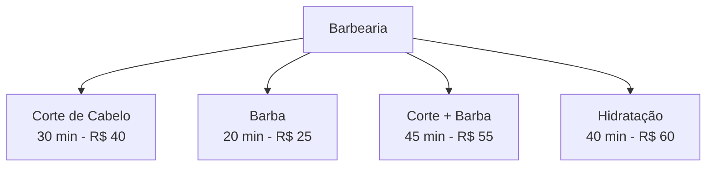
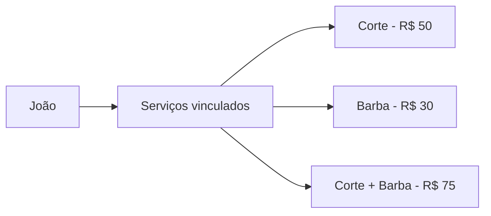

# Guia de Serviços

Serviços são o que você oferece aos seus clientes. Cada serviço tem nome, duração, preço e pode ser realizado por um ou mais profissionais.

## O que são serviços?

Representa uma atividade que pode ser agendada:



## Acessando serviços

1. Clique em **Configurações** no menu lateral
2. Selecione **Serviços**

## Criando um Serviço

### Passo a Passo

1. Na lista de serviços, clique em **Novo Serviço**
2. Preencha as informações
3. Clique em **Salvar**

### Campos do Serviço

| Campo | Obrigatório | Descrição |
|-------|-------------|-----------|
| Nome | ✅ | Nome exibido aos clientes |
| Descrição | ❌ | Detalhes sobre o serviço |
| Duração | ✅ | Tempo em minutos |
| Preço | ✅ | Valor do serviço |
| Categoria | ❌ | Agrupamento de serviços |
| Ativo | ✅ | Se está disponível |

### Exemplo de Preenchimento

```
Nome: Corte de Cabelo Masculino
Descrição: Corte tradicional com tesoura e máquina
Duração: 30 minutos
Preço: R$ 40,00
Categoria: Cabelo
Ativo: Sim
```

## Categorias de serviços

Organize seus serviços em categorias:

| Categoria | Serviços |
|-----------|-----------|
| Cabelo | Corte, Hidratação, Progressiva |
| Barba | Barba simples, Barba completa |
| Combos | Corte + Barba, Dia do Noivo |
| Tratamentos | Cauterização, Botox Capilar |

> [!TIP]
> Categorias aparecem no bot quando você usa o componente de **Seleção de Serviço**.

## Preços

### Preço base

O preço definido no serviço é o preço padrão, usado quando:

- Nenhum profissional específico é selecionado
- O profissional não tem preço personalizado

### Preço por profissional

Cada profissional pode ter um preço diferente:

| Serviço | João (Sênior) | Pedro (Júnior) |
|---------|---------------|----------------|
| Corte | R$ 50,00 | R$ 35,00 |
| Barba | R$ 30,00 | R$ 20,00 |

> [!NOTE]
> O preço personalizado é configurado no cadastro do [Profissional](/app/tutorials?doc=guides/profissionais).

## Duração dos Serviços

A duração é fundamental para o agendamento:

### Importância da Duração

- Define o tempo bloqueado na agenda
- Afeta a disponibilidade de horários
- Evita conflitos de agendamento

### Dicas para definir duração

| Tipo | Dica |
|------|------|
| Serviços rápidos | Arredonde para 15 ou 30 minutos |
| Serviços longos | Considere tempo de preparação |
| Combos | Some os tempos + intervalo |

Exemplo:
```
Corte simples:        30 min
Corte + Barba:        30 + 20 = 50 min (arredonde para 60)
Dia do Noivo:         120 min (2 horas)
```

## Serviços ativos e inativos

### Status do serviço

- **Ativo** — Disponível para agendamento
- **Inativo** — Não aparece para clientes

### Quando desativar

- Temporariamente indisponível
- Fora de estoque (se precisa de produtos)
- Em teste (ainda não liberado)

> [!TIP]
> Ao invés de excluir um serviço, desative-o. Assim você mantém o histórico de agendamentos.

## Vinculando serviços a profissionais

Para que um serviço apareça no agendamento:

1. Crie o serviço
2. Vá em **Profissionais**
3. Edite o profissional
4. Na aba **Serviços**, adicione o serviço



> [!WARNING]
> Um serviço sem profissionais vinculados não aparecerá no agendamento.

## Ordenação de Serviços

Controle a ordem que os serviços aparecem:

1. Edite o serviço
2. Defina o campo **Ordem** (número)
3. Serviços são listados em ordem crescente

Exemplo:
| Serviço | Ordem | Posição |
|---------|-------|---------|
| Corte de Cabelo | 1 | 1º |
| Barba | 2 | 2º |
| Corte + Barba | 3 | 3º |
| Tratamentos | 10 | 4º |

## Boas Práticas

### ✅ Faça

- Use nomes claros e objetivos
- Defina durações realistas
- Mantenha preços atualizados
- Organize em categorias

### ❌ Evite

- Nomes muito longos ou técnicos
- Durações muito curtas (causa estresse)
- Muitos serviços similares
- Deixar serviços sem profissionais

## Exemplos por segmento

### Barbearia
```
Corte Masculino - 30min - R$ 40
Barba - 20min - R$ 25
Corte + Barba - 50min - R$ 55
Pigmentação - 60min - R$ 80
```

### Salão de Beleza
```
Corte Feminino - 45min - R$ 80
Escova - 40min - R$ 50
Coloração - 120min - R$ 200
Manicure - 40min - R$ 35
```

### Clínica
```
Consulta - 30min - R$ 200
Retorno - 15min - R$ 0
Exame simples - 20min - R$ 100
Procedimento - 60min - R$ 350
```

---

## Próximos passos

- [Guia de Profissionais](/app/tutorials?doc=guides/profissionais) — Vincule serviços à equipe
- [Guia de Bots](/app/tutorials?doc=guides/bots) — Configure seleção de serviços
- [Guia de Estabelecimentos](/app/tutorials?doc=guides/estabelecimentos) — Organize por unidade
