# Guia de Serviços

Serviços são o que você oferece aos seus clientes. Cada serviço tem nome, duração, preço e pode ser realizado por um ou mais profissionais.

## O que são Serviços?

Um serviço representa uma atividade que pode ser agendada:

```mermaid
graph TD
    A[🏪 Barbearia] --> B[✂️ Corte de Cabelo<br/>30 min - R$ 40]
    A --> C[🧔 Barba<br/>20 min - R$ 25]
    A --> D[💇 Corte + Barba<br/>45 min - R$ 55]
    A --> E[💧 Hidratação<br/>40 min - R$ 60]
```



## Acessando Serviços

1. Clique em **Configurações** no menu lateral
2. Selecione **Serviços**
3. Você verá a lista de todos os serviços cadastrados

## Criando um Serviço

### Passo a Passo

1. Na lista de serviços, clique em **Novo Serviço**
2. Preencha as informações
3. Clique em **Salvar**

### Campos do Serviço

| Campo | Obrigatório | Descrição |
|-------|-------------|-----------|
| Nome | ✅ | Nome exibido aos clientes |
| Descrição | ❌ | Detalhes sobre o serviço |
| Duração | ✅ | Tempo em minutos |
| Preço | ✅ | Valor do serviço |
| Categoria | ❌ | Agrupamento de serviços |
| Ativo | ✅ | Se está disponível |

### Exemplo de Preenchimento

```
Nome: Corte de Cabelo Masculino
Descrição: Corte tradicional com tesoura e máquina
Duração: 30 minutos
Preço: R$ 40,00
Categoria: Cabelo
Ativo: Sim
```

## Categorias de Serviços

Organize seus serviços em categorias para facilitar a navegação:

| Categoria | Serviços |
|-----------|----------|
| Cabelo | Corte, Hidratação, Progressiva |
| Barba | Barba simples, Barba completa |
| Combos | Corte + Barba, Dia do Noivo |
| Tratamentos | Cauterização, Botox Capilar |

> [!TIP]
> Categorias aparecem no bot quando você usa o componente de **Seleção de Serviço**!

## Preços

### Preço Base

O preço definido no serviço é o preço padrão. Ele será usado quando:

- Nenhum profissional específico é selecionado
- O profissional não tem preço personalizado

### Preço por Profissional

Cada profissional pode ter um preço diferente para o mesmo serviço:

| Serviço | João (Sênior) | Pedro (Júnior) |
|---------|---------------|----------------|
| Corte | R$ 50,00 | R$ 35,00 |
| Barba | R$ 30,00 | R$ 20,00 |

> [!NOTE]
> O preço personalizado é configurado no cadastro do [Profissional](/app/tutorials?doc=guides/profissionais).

## Duração dos Serviços

A duração é fundamental para o agendamento:

### Importância da Duração

- Define o tempo bloqueado na agenda
- Afeta a disponibilidade de horários
- Evita conflitos de agendamento

### Dicas para definir duração

| Tipo | Dica |
|------|------|
| Serviços rápidos | Arredonde para 15 ou 30 minutos |
| Serviços longos | Considere tempo de preparação |
| Combos | Some os tempos + intervalo |

Exemplo:
```
Corte simples:        30 min
Corte + Barba:        30 + 20 = 50 min (arredonde para 60)
Dia do Noivo:         120 min (2 horas)
```

## Serviços Ativos e Inativos

### Status do Serviço

- **Ativo** - Disponível para agendamento
- **Inativo** - Não aparece para clientes

### Quando desativar um serviço

- 🔧 Temporariamente indisponível
- 📦 Fora de estoque (se precisa de produtos)
- 🧪 Em teste (ainda não liberado)

> [!TIP]
> Ao invés de excluir um serviço, desative-o. Assim você mantém o histórico de agendamentos!

## Vinculando Serviços a Profissionais

Para que um serviço apareça no agendamento:

1. Crie o serviço
2. Vá em **Profissionais**
3. Edite o profissional
4. Na aba **Serviços**, adicione o serviço

```mermaid
graph LR
    A[👨‍💼 João] --> B[Serviços vinculados]
    B --> C[✂️ Corte - R$ 50]
    B --> D[🧔 Barba - R$ 30]
    B --> E[💇 Corte + Barba - R$ 75]
```



> [!WARNING]
> Um serviço sem profissionais vinculados não aparecerá no agendamento!

## Ordenação de Serviços

Controle a ordem que os serviços aparecem:

1. Edite o serviço
2. Defina o campo **Ordem** (número)
3. Serviços são listados em ordem crescente

Exemplo:
| Serviço | Ordem | Posição |
|---------|-------|---------|
| Corte de Cabelo | 1 | 1º |
| Barba | 2 | 2º |
| Corte + Barba | 3 | 3º |
| Tratamentos | 10 | 4º |

## Boas Práticas

### ✅ Faça

- Use nomes claros e objetivos
- Defina durações realistas
- Mantenha preços atualizados
- Organize em categorias

### ❌ Evite

- Nomes muito longos ou técnicos
- Durações muito curtas (causa estresse)
- Muitos serviços similares
- Deixar serviços sem profissionais

## Exemplos por Segmento

### Barbearia
```
• Corte Masculino - 30min - R$ 40
• Barba - 20min - R$ 25
• Corte + Barba - 50min - R$ 55
• Pigmentação - 60min - R$ 80
```

### Salão de Beleza
```
• Corte Feminino - 45min - R$ 80
• Escova - 40min - R$ 50
• Coloração - 120min - R$ 200
• Manicure - 40min - R$ 35
```

### Clínica
```
• Consulta - 30min - R$ 200
• Retorno - 15min - R$ 0
• Exame simples - 20min - R$ 100
• Procedimento - 60min - R$ 350
```

---

## Próximos Passos

- 📖 [Guia de Profissionais](/app/tutorials?doc=guides/profissionais) - Vincule serviços à equipe
- 📖 [Guia de Bots](/app/tutorials?doc=guides/bots) - Configure seleção de serviços
- 📖 [Guia de Estabelecimentos](/app/tutorials?doc=guides/estabelecimentos) - Organize por unidade
